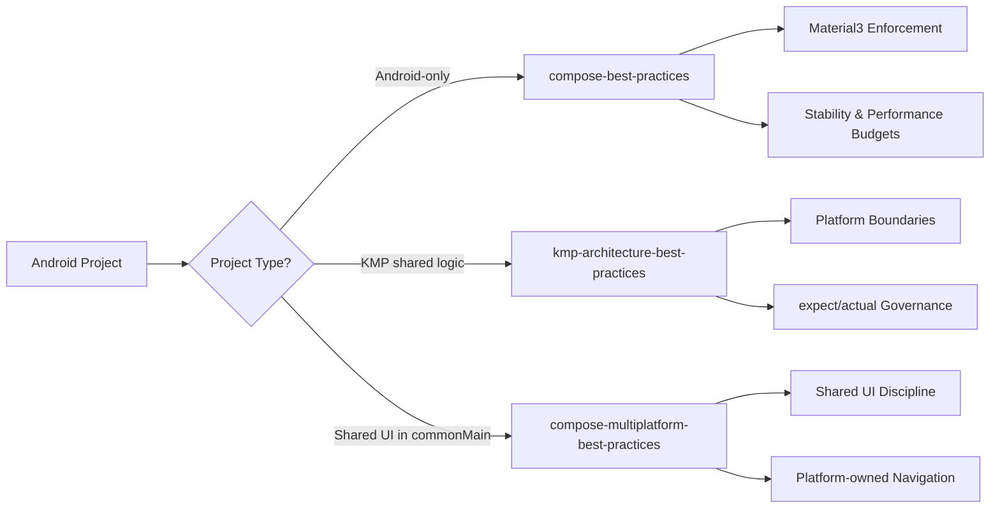
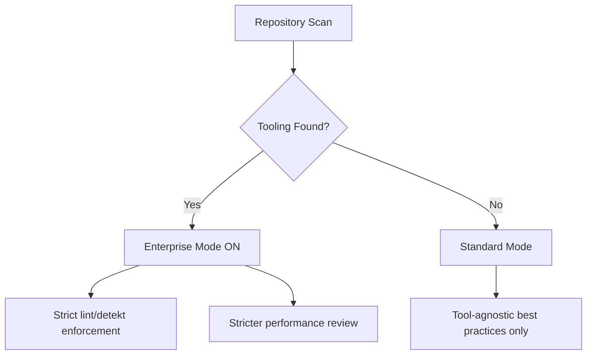
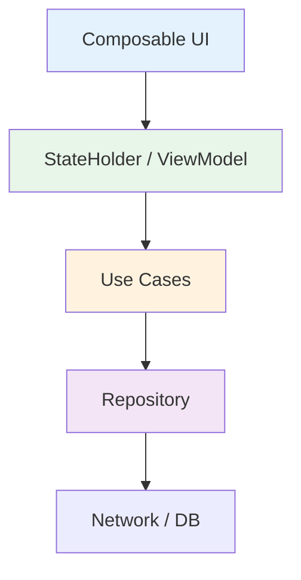

[](https://github.com/OWNER/REPO/actions)
[](https://www.npmjs.com/package/android-ai-skills)
[](LICENSE)

# 🚀 Android AI Architecture Skills

Opinionated, production-grade AI skills for Android, Kotlin Multiplatform (KMP),
and Compose Multiplatform projects.

This repository provides structured **AI governance layers** that enforce
architecture, performance, and scalability best practices automatically.

---

# 🎯 Why This Exists

Modern Android & KMP projects grow complex quickly.

These AI skills:

- Enforce **Material3-only Compose**
- Prevent architecture drift
- Protect performance budgets
- Keep KMP boundaries clean
- Scale from indie to enterprise
- Adapt automatically (Enterprise Mode auto-detection)

---

# 🧠 Skill Ecosystem



---

# 📦 Included Skills

## 1️⃣ compose-best-practices

For Android-only Jetpack Compose apps.

### Enforces

- Material3-only (🚫 no M2 mixing)
- Stateless composables + UDF
- StateFlow + SharedFlow patterns
- Lifecycle-aware collection
- Compose stability guidelines
- Performance budgets
- Optional Enterprise Mode

---

## 2️⃣ kmp-architecture-best-practices

For shared business logic in Kotlin Multiplatform.

### Enforces

- No Android leakage into commonMain
- No java.time in shared code
- Proper expect/actual boundaries
- Shared StateHolder pattern
- Dispatcher injection
- Multiplatform-safe flows

---

## 3️⃣ compose-multiplatform-best-practices

For shared UI in commonMain using Compose Multiplatform.

### Enforces

- No Android ViewModel in shared UI
- Platform-owned navigation
- Shared state holder model
- Multiplatform Material usage
- Platform adapter pattern

---

# 🔥 Enterprise Mode (Auto-Detection)

Enterprise Mode activates automatically if the repository contains:

- detekt.yml / detekt.yaml
- lint.xml
- ktlint config
- spotless config



### When Enterprise Mode is ON:

- No new lint/detekt violations allowed
- Suppressions must be minimal & justified
- Performance risks treated as HIGH severity

### When OFF:

- Tool-specific enforcement disabled
- Architecture + performance rules still enforced

---

# ⚡ Performance Governance

Performance is treated as a first-class citizen.

### Budgets Enforced

- Stable Lazy list keys mandatory
- No heavy allocations in recomposition paths
- No suspend calls in composable bodies
- No infinite LaunchedEffect restarts
- Prevent broad screen recomposition

---

# 🏗 Architecture Governance



Principles:

- UI renders state only
- Business logic outside composables
- Shared logic lives in commonMain (KMP)
- Platform-specific code isolated

---

# 🧪 Stability & Compose Compiler Alignment

The skills encourage:

- Immutable UI models
- Stable parameters
- Correct remember usage
- Minimal recomposition surfaces
- Proper effect keys

This ensures Compose can skip recomposition effectively.

---

# 📂 Repository Structure

```
compose-best-practices/
kmp-architecture-best-practices/
compose-multiplatform-best-practices/
README.md
```

---

# 📖 How To Use

1. Place the skills inside:
   - ~/.codex/skills/
   - ~/.claude/skills/
   - or project-level .codex/skills/

2. Add AGENTS.md to your project root (optional but recommended).

3. The correct skill activates automatically based on project structure.

---

# 🎉 Result

You now have:

- Predictable AI code reviews
- Performance-aware AI refactors
- Architecture enforcement across Android + KMP
- Enterprise-ready governance without overengineering

---

# 🛡 License

MIT – Use freely in personal, startup, or enterprise projects.
---

# 🧰 Install via npx

You can install the skills globally into the standard locations for **Codex** and **Claude**:

- `~/.codex/skills/`
- `~/.claude/skills/`

## Install (default: both)

```bash
npx android-ai-skills@latest
```

## Install only one skill

```bash
npx android-ai-skills@latest --android-only
npx android-ai-skills@latest --kmp-only
npx android-ai-skills@latest --compose-mp-only
```

## Install only for one target

```bash
npx android-ai-skills@latest --target codex
npx android-ai-skills@latest --target claude
```

## Dry run

```bash
npx android-ai-skills@latest --dry-run
```

## Uninstall

```bash
npx android-ai-skills@latest uninstall
npx android-ai-skills@latest uninstall --target codex
```

---

# 🧾 Auto-detect Enterprise Mode (Tooling-aware)

Enterprise Mode activates automatically **only if tooling is detected** in the project root:

- `detekt.yml` / `detekt.yaml`
- `lint.xml`
- ktlint config
- spotless config

If tooling is not detected, the skills remain tool-agnostic and **do not** enforce lint/detekt specifics.

### Generate an AGENTS.md in your repo

```bash
npx android-ai-skills@latest init
# or write it somewhere else:
npx android-ai-skills@latest init --path .
```

### Print where skills will be installed

```bash
npx android-ai-skills@latest print-paths
# or include paths during install:
npx android-ai-skills@latest --print-paths
```
