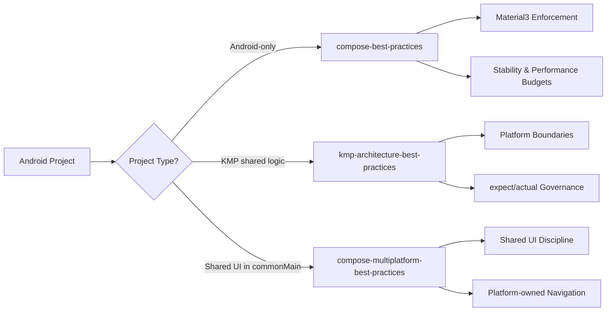
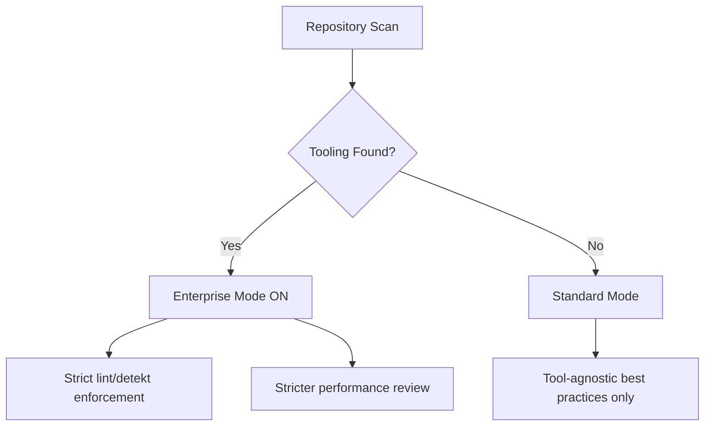
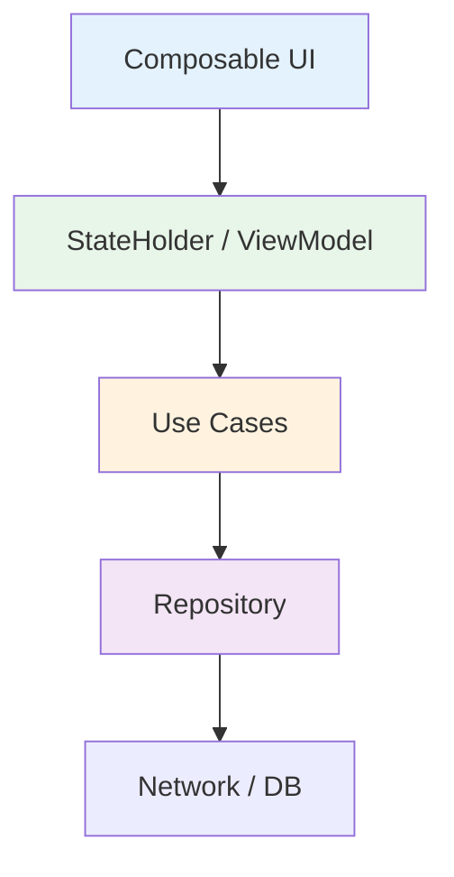

[](https://github.com/noloman/android-ai-skills/actions)
[](https://www.npmjs.com/package/android-ai-skills)
[](LICENSE)

# Android AI Architecture Skills

Opinionated, production-grade AI skills for Android, Kotlin Multiplatform (KMP),
and Compose Multiplatform projects.

Works with **Codex, Claude Code, GitHub Copilot, Cursor, Windsurf, Cline,
JetBrains AI, Amazon Q & Aider**.

---

## Supported AI Tools

### Global install (home directory)

| Tool | Path | Format |
|------|------|--------|
| Codex | `~/.codex/skills/<name>/SKILL.md` | Directory copy |
| Claude Code | `~/.claude/rules/<name>.md` | Flattened markdown |

### Project-level (`init` command)

| Tool | Path | Format |
|------|------|--------|
| Codex | `AGENTS.md` | Single markdown file |
| Claude Code | `CLAUDE.md` | Single markdown file |
| GitHub Copilot | `.github/copilot-instructions.md` | Single markdown file |
| Cursor | `.cursor/rules/<name>.mdc` | MDC per skill |
| Windsurf | `.windsurfrules` | Single markdown file |
| Cline | `.clinerules/<name>.md` | Markdown per skill |
| JetBrains AI | `.aiassistant/rules/<name>.md` | Markdown per skill |
| Amazon Q | `.amazonq/rules/<name>.md` | Markdown per skill |
| Aider | `CONVENTIONS.md` + `.aider.conf.yml` | Single markdown + YAML |

---

## Why This Exists

Modern Android & KMP projects grow complex quickly.

These AI skills:

- Enforce **Material3-only Compose**
- Prevent architecture drift
- Protect performance budgets
- Keep KMP boundaries clean
- Scale from indie to enterprise
- Adapt automatically (Enterprise Mode auto-detection)

---

## Skill Ecosystem



---

## Included Skills

### 1. compose-best-practices

For Android-only Jetpack Compose apps.

**Enforces:**
- Material3-only (no M2 mixing)
- Stateless composables + UDF
- StateFlow + SharedFlow patterns
- Lifecycle-aware collection
- Compose stability guidelines
- Performance budgets
- Optional Enterprise Mode

---

### 2. kmp-architecture-best-practices

For shared business logic in Kotlin Multiplatform.

**Enforces:**
- No Android leakage into commonMain
- No java.time in shared code
- Proper expect/actual boundaries
- Shared StateHolder pattern
- Dispatcher injection
- Multiplatform-safe flows

---

### 3. compose-multiplatform-best-practices

For shared UI in commonMain using Compose Multiplatform.

**Enforces:**
- No Android ViewModel in shared UI
- Platform-owned navigation
- Shared state holder model
- Multiplatform Material usage
- Platform adapter pattern

---

## Enterprise Mode (Auto-Detection)

Enterprise Mode activates automatically if the repository contains:

- detekt.yml / detekt.yaml
- lint.xml
- ktlint config
- spotless config



### When Enterprise Mode is ON:

- No new lint/detekt violations allowed
- Suppressions must be minimal & justified
- Performance risks treated as HIGH severity

### When OFF:

- Tool-specific enforcement disabled
- Architecture + performance rules still enforced

---

## Install via npx

### Global install (default: Codex + Claude Code)

```bash
npx android-ai-skills@latest
```

### Install only one skill

```bash
npx android-ai-skills@latest --android-only
npx android-ai-skills@latest --kmp-only
npx android-ai-skills@latest --compose-mp-only
```

### Install only for one target

```bash
npx android-ai-skills@latest --target codex
npx android-ai-skills@latest --target claude
```

### Dry run

```bash
npx android-ai-skills@latest --dry-run
```

### Uninstall

```bash
npx android-ai-skills@latest uninstall
npx android-ai-skills@latest uninstall --target codex
```

---

## Project-level init (all 9 tools)

Generate project-level instruction files for all supported AI tools:

```bash
npx android-ai-skills@latest init
```

### Select specific tools

```bash
npx android-ai-skills@latest init --tools cursor,copilot
npx android-ai-skills@latest init --tools claude,codex
```

### Exclude tools

```bash
npx android-ai-skills@latest init --exclude aider
```

### Smaller output (skip reference docs)

```bash
npx android-ai-skills@latest init --no-references
```

### Overwrite existing files

```bash
npx android-ai-skills@latest init --force
```

### Generated files

Running `init` with defaults creates:

```
AGENTS.md                                    # Codex
CLAUDE.md                                    # Claude Code
.github/copilot-instructions.md              # GitHub Copilot
.cursor/rules/compose-best-practices.mdc     # Cursor (per skill)
.cursor/rules/kmp-architecture-best-practices.mdc
.cursor/rules/compose-multiplatform-best-practices.mdc
.windsurfrules                               # Windsurf
.clinerules/compose-best-practices.md        # Cline (per skill)
.clinerules/kmp-architecture-best-practices.md
.clinerules/compose-multiplatform-best-practices.md
.aiassistant/rules/compose-best-practices.md # JetBrains AI (per skill)
.aiassistant/rules/kmp-architecture-best-practices.md
.aiassistant/rules/compose-multiplatform-best-practices.md
.amazonq/rules/compose-best-practices.md     # Amazon Q (per skill)
.amazonq/rules/kmp-architecture-best-practices.md
.amazonq/rules/compose-multiplatform-best-practices.md
CONVENTIONS.md                               # Aider
.aider.conf.yml
```

---

## Print resolved paths

```bash
npx android-ai-skills@latest print-paths
```

---

## Performance Governance

Performance is treated as a first-class citizen.

### Budgets Enforced

- Stable Lazy list keys mandatory
- No heavy allocations in recomposition paths
- No suspend calls in composable bodies
- No infinite LaunchedEffect restarts
- Prevent broad screen recomposition

---

## Architecture Governance



Principles:

- UI renders state only
- Business logic outside composables
- Shared logic lives in commonMain (KMP)
- Platform-specific code isolated

---

## Stability & Compose Compiler Alignment

The skills encourage:

- Immutable UI models
- Stable parameters
- Correct remember usage
- Minimal recomposition surfaces
- Proper effect keys

This ensures Compose can skip recomposition effectively.

---

## Repository Structure

```
compose-best-practices/
kmp-architecture-best-practices/
compose-multiplatform-best-practices/
README.md
```

---

## License

MIT -- Use freely in personal, startup, or enterprise projects.
