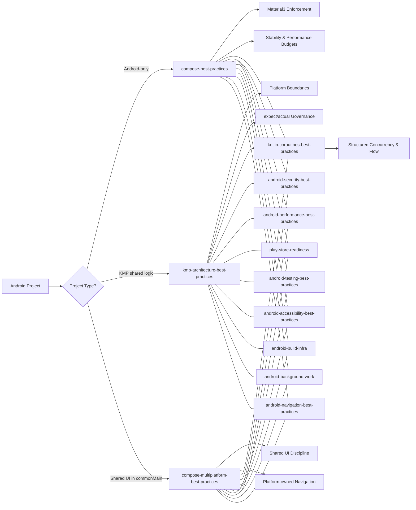
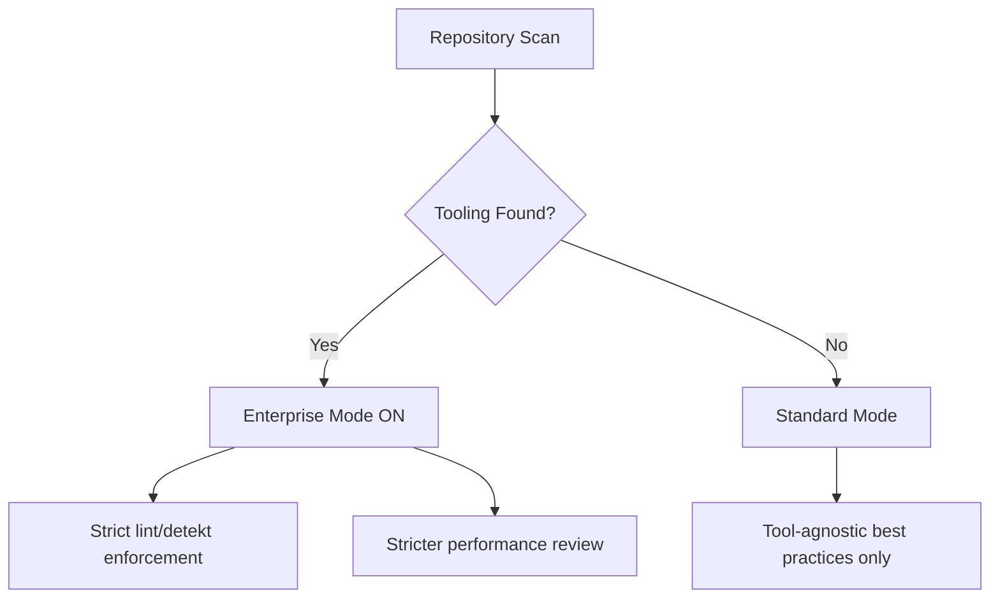
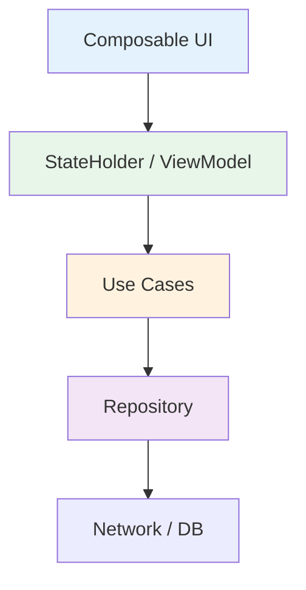

[](https://github.com/noloman/android-ai-skills/actions)
[](https://www.npmjs.com/package/android-ai-skills)
[](LICENSE)

# Android AI Architecture Skills

Opinionated, production-grade AI skills for Android, Kotlin Multiplatform (KMP),
and Compose Multiplatform projects.

Works with **Codex, Claude Code, GitHub Copilot, Cursor, Windsurf, Cline,
JetBrains AI, Amazon Q & Aider**.

---

## Supported AI Tools

### Global install (home directory)

| Tool | Path | Format |
|------|------|--------|
| Codex | `~/.codex/skills/<name>/SKILL.md` | Directory copy |
| Claude Code | `~/.claude/rules/<name>.md` | Flattened markdown |

### Project-level (`init` command)

| Tool | Path | Format |
|------|------|--------|
| Codex | `AGENTS.md` | Single markdown file |
| Claude Code | `CLAUDE.md` | Single markdown file |
| GitHub Copilot | `.github/copilot-instructions.md` | Single markdown file |
| Cursor | `.cursor/rules/<name>.mdc` | MDC per skill |
| Windsurf | `.windsurfrules` | Single markdown file |
| Cline | `.clinerules/<name>.md` | Markdown per skill |
| JetBrains AI | `.aiassistant/rules/<name>.md` | Markdown per skill |
| Amazon Q | `.amazonq/rules/<name>.md` | Markdown per skill |
| Aider | `CONVENTIONS.md` + `.aider.conf.yml` | Single markdown + YAML |

---

## Why This Exists

Modern Android & KMP projects grow complex quickly.

These AI skills:

- Enforce **Material3-only Compose**
- Prevent architecture drift
- Protect performance budgets
- Keep KMP boundaries clean
- Harden **security** (secrets, storage, network, components)
- Ensure **Play Store compliance** (Data Safety, permissions, target SDK)
- Enforce **accessibility** (WCAG AA contrast, touch targets, TalkBack)
- Optimize **performance** (startup, memory, battery, app size)
- Maintain **test quality** (test pyramid, Compose testing, screenshot tests)
- Standardize **build infrastructure** (version catalogs, convention plugins, modularization)
- Govern **background work** (WorkManager, foreground services, notifications)
- Guide **navigation** (type-safe routes, deep links, App Links)
- Scale from indie to enterprise
- Adapt automatically (Enterprise Mode auto-detection)

---

## Skill Ecosystem



---

## Included Skills

### 1. compose-best-practices

For Android-only Jetpack Compose apps.

**Enforces:**
- Material3-only (no M2 mixing)
- Stateless composables + UDF
- StateFlow + SharedFlow patterns
- Lifecycle-aware collection
- Compose stability guidelines
- Performance budgets
- Optional Enterprise Mode

---

### 2. kmp-architecture-best-practices

For shared business logic in Kotlin Multiplatform.

**Enforces:**
- No Android leakage into commonMain
- No java.time in shared code
- Proper expect/actual boundaries
- Shared StateHolder pattern
- Dispatcher injection
- Multiplatform-safe flows

---

### 3. compose-multiplatform-best-practices

For shared UI in commonMain using Compose Multiplatform.

**Enforces:**
- No Android ViewModel in shared UI
- Platform-owned navigation
- Shared state holder model
- Multiplatform Material usage
- Platform adapter pattern

---

### 4. kotlin-coroutines-best-practices

Cross-cutting skill that always activates alongside the project-type-specific skill.

**Enforces:**
- No GlobalScope — scoped coroutines only
- Structured concurrency with parent-child job hierarchies
- Cooperative cancellation (isActive, ensureActive)
- Never catch CancellationException
- Dispatcher injection — no hardcoded Dispatchers.Main in shared code
- StateFlow for UI state, SharedFlow for events
- Test coroutines with TestDispatcher + runTest

---

### 5. android-security-best-practices

Cross-cutting skill — secrets management, secure storage, network security, component hardening.

**Enforces:**
- No hardcoded secrets in source code
- EncryptedSharedPreferences / Android Keystore for sensitive data
- HTTPS enforcement with Network Security Config
- exported="false" by default on all components
- PendingIntent.FLAG_IMMUTABLE, WebView file access disabled
- R8 enabled for release builds
- No sensitive data in logs

---

### 6. android-performance-best-practices

Cross-cutting skill — startup optimization, memory management, battery, app size.

**Enforces:**
- TTID < 2s, TTFD < 4s
- No heavy init on main thread during onCreate()
- App Startup library, Baseline Profiles
- No static Activity/Context references
- StrictMode in debug builds
- R8 + resource shrinking for release
- WebP assets, Doze-aware networking

---

### 7. play-store-readiness

Cross-cutting skill — Data Safety, permissions, target SDK, signing, release process.

**Enforces:**
- Data Safety section matches actual SDK behavior
- Runtime permissions at point of use with rationale
- Annual target SDK compliance
- Play App Signing with separate upload key
- AAB format, staged rollout (5-10%)
- Crash-free rate target >= 99%
- No debuggable release builds

---

### 8. android-testing-best-practices

Cross-cutting skill — Compose UI testing, screenshot tests, Room migrations, CI strategy.

**Enforces:**
- Test pyramid (unit > integration > E2E)
- Compose testing APIs for Compose UI (not Espresso)
- Fakes over mocks
- Room schema export + migration tests
- Descriptive test names, no Thread.sleep()
- Deterministic tests, flaky test quarantine
- TestDispatcher + runTest for coroutines

---

### 9. android-accessibility-best-practices

Cross-cutting skill — content descriptions, TalkBack, touch targets, contrast, semantics.

**Enforces:**
- contentDescription on all interactive non-text elements
- 48dp minimum touch targets
- WCAG AA contrast (4.5:1 normal, 3:1 large text)
- No color-only information
- Logical TalkBack reading order
- Correct semantics on custom composables
- sp (not dp) for text sizes

---

### 10. android-build-infra

Cross-cutting skill — version catalogs, convention plugins, modularization, build variants.

**Enforces:**
- Gradle version catalogs (libs.versions.toml) for all dependencies
- Convention plugins for shared build config
- Feature modularization (feature-api/feature-impl)
- Dependencies flow inward, no feature-to-feature deps
- implementation scope by default
- Build variants for debug/release/staging

---

### 11. android-background-work

Cross-cutting skill — WorkManager, foreground services, notifications, scheduling.

**Enforces:**
- WorkManager for deferrable persistent work
- Foreground service types declared (API 34+)
- Notification channels (API 26+)
- Never hold WakeLocks indefinitely
- Exact alarms only for user-visible scheduling
- POST_NOTIFICATIONS permission (API 33+)

---

### 12. android-navigation-best-practices

Cross-cutting skill — type-safe routes, deep links, App Links, navigation patterns.

**Enforces:**
- Type-safe navigation (data class/object routes)
- App Links verified with Digital Asset Links
- Deep link fallbacks for non-installed users
- No heavy logic in navigation callbacks
- Standard launch mode with Navigation
- Deep link parameter validation

---

## Enterprise Mode (Auto-Detection)

Enterprise Mode activates automatically if the repository contains:

- detekt.yml / detekt.yaml
- lint.xml
- ktlint config
- spotless config



### When Enterprise Mode is ON:

- No new lint/detekt violations allowed
- Suppressions must be minimal & justified
- Performance risks treated as HIGH severity

### When OFF:

- Tool-specific enforcement disabled
- Architecture + performance rules still enforced

---

## Install via npx

### Global install (default: Codex + Claude Code)

```bash
npx android-ai-skills@latest
```

### Install only one skill

```bash
npx android-ai-skills@latest --android-only
npx android-ai-skills@latest --kmp-only
npx android-ai-skills@latest --compose-mp-only
```

### Install only for one target

```bash
npx android-ai-skills@latest --target codex
npx android-ai-skills@latest --target claude
```

### Dry run

```bash
npx android-ai-skills@latest --dry-run
```

### Uninstall

```bash
npx android-ai-skills@latest uninstall
npx android-ai-skills@latest uninstall --target codex
```

---

## Project-level init (all 9 tools)

Generate project-level instruction files for all supported AI tools:

```bash
npx android-ai-skills@latest init
```

### Select specific tools

```bash
npx android-ai-skills@latest init --tools cursor,copilot
npx android-ai-skills@latest init --tools claude,codex
```

### Exclude tools

```bash
npx android-ai-skills@latest init --exclude aider
```

### Smaller output (skip reference docs)

```bash
npx android-ai-skills@latest init --no-references
```

### Overwrite existing files

```bash
npx android-ai-skills@latest init --force
```

### Generated files

Running `init` with defaults creates:

```
AGENTS.md                                            # Codex
CLAUDE.md                                            # Claude Code
.github/copilot-instructions.md                      # GitHub Copilot
.cursor/rules/compose-best-practices.mdc             # Cursor (per skill)
.cursor/rules/kmp-architecture-best-practices.mdc
.cursor/rules/compose-multiplatform-best-practices.mdc
.cursor/rules/kotlin-coroutines-best-practices.mdc
.cursor/rules/android-security-best-practices.mdc
.cursor/rules/android-performance-best-practices.mdc
.cursor/rules/play-store-readiness.mdc
.cursor/rules/android-testing-best-practices.mdc
.cursor/rules/android-accessibility-best-practices.mdc
.cursor/rules/android-build-infra.mdc
.cursor/rules/android-background-work.mdc
.cursor/rules/android-navigation-best-practices.mdc
.windsurfrules                                       # Windsurf
.clinerules/compose-best-practices.md                # Cline (per skill)
.clinerules/kmp-architecture-best-practices.md
.clinerules/compose-multiplatform-best-practices.md
.clinerules/kotlin-coroutines-best-practices.md
.clinerules/android-security-best-practices.md
.clinerules/android-performance-best-practices.md
.clinerules/play-store-readiness.md
.clinerules/android-testing-best-practices.md
.clinerules/android-accessibility-best-practices.md
.clinerules/android-build-infra.md
.clinerules/android-background-work.md
.clinerules/android-navigation-best-practices.md
.aiassistant/rules/compose-best-practices.md         # JetBrains AI (per skill)
.aiassistant/rules/kmp-architecture-best-practices.md
.aiassistant/rules/compose-multiplatform-best-practices.md
.aiassistant/rules/kotlin-coroutines-best-practices.md
.aiassistant/rules/android-security-best-practices.md
.aiassistant/rules/android-performance-best-practices.md
.aiassistant/rules/play-store-readiness.md
.aiassistant/rules/android-testing-best-practices.md
.aiassistant/rules/android-accessibility-best-practices.md
.aiassistant/rules/android-build-infra.md
.aiassistant/rules/android-background-work.md
.aiassistant/rules/android-navigation-best-practices.md
.amazonq/rules/compose-best-practices.md             # Amazon Q (per skill)
.amazonq/rules/kmp-architecture-best-practices.md
.amazonq/rules/compose-multiplatform-best-practices.md
.amazonq/rules/kotlin-coroutines-best-practices.md
.amazonq/rules/android-security-best-practices.md
.amazonq/rules/android-performance-best-practices.md
.amazonq/rules/play-store-readiness.md
.amazonq/rules/android-testing-best-practices.md
.amazonq/rules/android-accessibility-best-practices.md
.amazonq/rules/android-build-infra.md
.amazonq/rules/android-background-work.md
.amazonq/rules/android-navigation-best-practices.md
CONVENTIONS.md                                       # Aider
.aider.conf.yml
```

---

## Print resolved paths

```bash
npx android-ai-skills@latest print-paths
```

---

## Performance Governance

Performance is treated as a first-class citizen.

### Budgets Enforced

- Stable Lazy list keys mandatory
- No heavy allocations in recomposition paths
- No suspend calls in composable bodies
- No infinite LaunchedEffect restarts
- Prevent broad screen recomposition

---

## Architecture Governance



Principles:

- UI renders state only
- Business logic outside composables
- Shared logic lives in commonMain (KMP)
- Platform-specific code isolated

---

## Stability & Compose Compiler Alignment

The skills encourage:

- Immutable UI models
- Stable parameters
- Correct remember usage
- Minimal recomposition surfaces
- Proper effect keys

This ensures Compose can skip recomposition effectively.

---

## Repository Structure

```
compose-best-practices/
kmp-architecture-best-practices/
compose-multiplatform-best-practices/
kotlin-coroutines-best-practices/
android-security-best-practices/
android-performance-best-practices/
play-store-readiness/
android-testing-best-practices/
android-accessibility-best-practices/
android-build-infra/
android-background-work/
android-navigation-best-practices/
README.md
```

---

## License

MIT -- Use freely in personal, startup, or enterprise projects.
